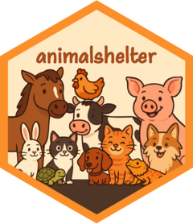

<!-- README.md is generated from README.Rmd. Please edit that file -->

```{r, include = FALSE}
knitr::opts_chunk$set(
  collapse = TRUE,
  comment = "#>",
  fig.path = "man/figures/README-",
  out.width = "100%"
)
```

# animalshelter <a href="https://emilhvitfeldt.github.io/animalshelter/"></a>

<!-- badges: start -->
<!-- badges: end -->

The goal of animalshelter is to provide a data set for [Long Beach Animal Shelter](https://data.longbeach.gov/explore/dataset/animal-shelter-intakes-and-outcomes).

## Installation

You can install the development version of animalshelter like so:

``` r
# install.packages("devtools")
devtools::install_github("EmilHvitfeldt/animalshelter")
```

## Example

This package contains one data set `longbeach`, 

```{r example}
library(tidyverse)
library(animalshelter)

longbeach
```

```{r}
glimpse(longbeach)
```

```{r}
longbeach |>
  count(animal_type)
```

```{r}
longbeach |>
  count(primary_color, sort = TRUE)
```